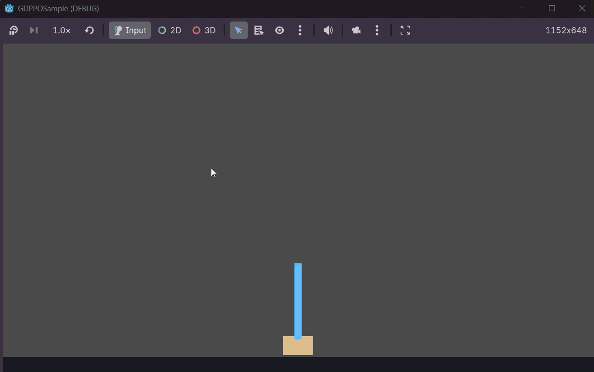
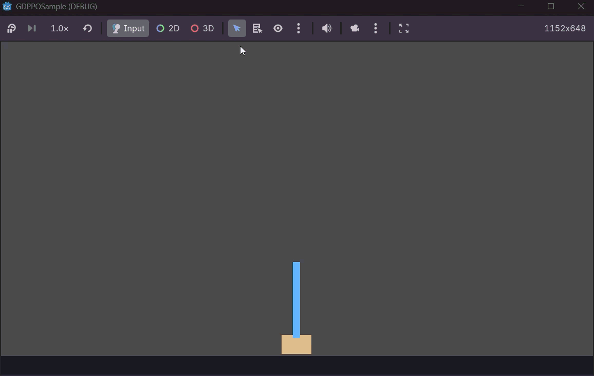

[](https://github.com/halfdisposal/GDPPO/stargazers)
[](https://github.com/halfdisposal/GDPPO/network/members)
[](https://github.com/halfdisposal/GDPPO/issues)
[](https://github.com/halfdisposal/GDPPO/watchers)
[](https://github.com/halfdisposal/GDPPO)
[](https://github.com/halfdisposal/GDPPO/commits/main)

[](https://isocpp.org/)
[](https://docs.godotengine.org/en/stable/getting_started/scripting/gdscript/index.html)
[](https://godotengine.org/)
[](https://www.mlpack.org/)

# GDPPO - Reinforcement Learning in Godot


## Introduction

Reinforcement learning (RL) is powerful, but integrating it into game engines isn't straightforward. Most game object AI, examples including path-finders, etc; are simple algorithm based and does not allow much flexibility.

This addon [GDPPO](https://github.com/halfdisposal/GDPPO.git) is based on [MLPack](https://www.mlpack.org/) (a fast C++ ML library) and uses it as a backend for training and inference of the models.

## Motivation & Use Cases

**Why build this?**
- **No external dependencies**: Agents run inside Godot; no Python server to manage
- **Faster iteration**: Train in-engine, test immediately
- **Native performance**: MLPack's C++ backend is efficient
- **Familiar workflow**: Define agents in GDScript, extend `PPOEnvironment`

**Example use cases:**
- Training procedural NPC behavior
- Game-aware optimization (tuning difficulty, reward structures)
- Research on game AI without leaving the editor

---

## Architecture Overview

### High-Level Design

```
┌─────────────────────────────────┐
│       GDScript Layer            │
│  (PPO, PPOEnvironment refs)     │
└──────────────┬──────────────────┘
               │
         [GDExtension Bindings]
               │
┌──────────────▼──────────────────┐
│      C++ Plugin Layer           │
│  (MLPack wrapper, PPO impl.)    │
└─────────────────────────────────┘
```

**Key components:**

| Component | Responsibility |
|-----------|-----------------|
| `PPOEnvironment` | GDScript base class; child implements overloads `_step()`, `_reset()`, `_state()`, `_get_state_dims()`, `_get_action_dims()` |
| `PPO` | Godot RefObject wrapping MLPack's PPO algorithm |
| `MLPack bindings` | C++ layer exposing model architecture, training, inference |

### Supported Architecture

- **Layers**: Linear (fully connected)
- **Activations**: ReLU, Sigmoid, tanh, Leaky ReLU, softmax, logsoftmax
- **Algorithm**: PPO (Proximal Policy Optimization)
- **Inference**: Single-step policy evaluation, batch inference

---

## Setting Up Your Environment

### Installation

**The Addon is still under development and security checks. Stay tuned for further updates.**

## Building Your First Agent

### Step 1: Define the Environment

Extend `PPOEnvironment` and implement the required methods:

```gdscript
extends PPOEnvironment # Make Sure to extend this RefCounted Object
class_name CartPoleEnv

# Define the Environment Parameters
const GRAVITY := 9.8
const MASS_CART := 1.0
const MASS_POLE := 0.1
const TOTAL_MASS := MASS_CART + MASS_POLE
const POLE_HALF_LENGTH := 0.5
const POLE_MASS_LENGTH := MASS_POLE * POLE_HALF_LENGTH
const FORCE_MAG := 10.0
const TAU := 0.02

const THETA_THRESHOLD := deg_to_rad(12.0)
const X_THRESHOLD := 2.4
const MAX_STEPS := 500

var x := 0.0
var x_dot := 0.0
var theta := 0.0
var theta_dot := 0.0
var steps := 0

var KE: float = 0.0
var PE: float = 0.0

# Public Available API to reset the environment state after each episode
func _reset() -> PackedFloat32Array:
	x = randf_range(-0.5, 0.5)
	x_dot = randf_range(-0.2, 0.2)
	theta = randf_range(-0.2, 0.2)
	theta_dot = randf_range(-0.2, 0.2)
	steps = 0
	KE = 0.5 * (MASS_CART + MASS_POLE) * pow(x_dot, 2) + 0.5 * pow(theta_dot, 2)
	PE = GRAVITY * MASS_POLE * POLE_HALF_LENGTH * 2 * cos(theta)
	return _state()


func reset_to(p_x: float, p_x_dot: float, p_theta: float, p_theta_dot: float) -> PackedFloat32Array:
	x = p_x
	x_dot = p_x_dot
	theta = p_theta
	theta_dot = p_theta_dot
	steps = 0
	return _state()

# Public Available API for an action step in the environment
# Musr Return a Dictionary with atleast fields "state", "reward" and "done" for the internal backend to access the current state
func _step(action: int) -> Dictionary:
	var force := FORCE_MAG if action == 1 else -FORCE_MAG
	var cos_theta := cos(theta)
	var sin_theta := sin(theta)
	var temp := (force + POLE_MASS_LENGTH * theta_dot * theta_dot * sin_theta) / TOTAL_MASS
	var theta_acc := (GRAVITY * sin_theta - cos_theta * temp) / \
		(POLE_HALF_LENGTH * (4.0 / 3.0 - MASS_POLE * cos_theta * cos_theta / TOTAL_MASS))
	var x_acc := temp - POLE_MASS_LENGTH * theta_acc * cos_theta / TOTAL_MASS

	x += TAU * x_dot
	x_dot += TAU * x_acc
	theta += TAU * theta_dot
	theta_dot += TAU * theta_acc
	steps += 1

	var done := absf(x) > X_THRESHOLD or absf(theta) > THETA_THRESHOLD or steps >= MAX_STEPS
	var KE_1 = 0.5 * (MASS_CART + MASS_POLE) * pow(x_dot, 2) + 0.5 * pow(theta_dot, 2)
	var PE_1 = GRAVITY * MASS_POLE * POLE_HALF_LENGTH * 2 * cos(theta)

	var diff: float = absf((KE + PE) - (KE_1 + PE_1))/(KE + PE + 1e-8)
	var reward := 1.0 - diff if not done or steps >= MAX_STEPS else 0.0

	return {"state": _state(), "reward": reward, "done": done}

# Public Available API for setting the state dims for internal calculations
# Important!! in order to have the environment backend know the state size
func _get_state_dims() -> int: return 4

# Public Available API for setting the action dims for internal calculations
# Important !! in order to have the environment backend to take proper step based on model predictions
func _get_action_dims() -> int: return 2

func _state() -> PackedFloat32Array:
	return PackedFloat32Array([x, x_dot, theta, theta_dot])

```

### Step 2: Create and Train the Agent

```gdscript
extends Node2D

const PIXELS_PER_METER := 100.0

# Initialize the Environment and Model
@onready var env := CartPoleEnv.new()
@onready var ppo := PPO.new()

# Access GUI Elements
@onready var cart: Node2D = $Cart
@onready var pole: Node2D = $Pole

# Define the training parameters
@export var total_timesteps: int = 200000
@export var rollout_steps: int = 2048
@export var epochs_per_update: int = 10
@export var minibatch_size: int = 64
@export var clip_eps: float = 0.2
@export var gamma: float = 0.99
@export var gae_lambda: float = 0.95
@export var actor_lr: float = 0.0003
@export var critic_lr: float = 0.001
@export var print_loss: bool = true
@export var print_every: int = 1

var running := false
var current_position: Vector2

# Override the ready function to build the model
func _ready() -> void:
	current_position = cart.global_position

	if cart is RigidBody2D: cart.freeze = true
	if pole is RigidBody2D: pole.freeze = true

	# Layers are Defined via Array of Dictionary
	# with fields
	# "layer_id" [LINEAR_LAYER, ACTIVATION_LAYER]
	# "out_dims" output dims of the layer
	# "activation" [RELU, SIGMOID, SOFTMAX, LEAKYRELU, TANH, LOGSOFTMAX]
	var actor_layers: Array = [
		{"layer_id": NNModel.LINEAR_LAYER, "out_dims": 32},
		{"layer_id": NNModel.ACTIVATION_LAYER, "activation": NNModel.TANH},
		{"layer_id": NNModel.LINEAR_LAYER, "out_dims": 64},
		{"layer_id": NNModel.ACTIVATION_LAYER, "activation": NNModel.TANH},
		{"layer_id": NNModel.LINEAR_LAYER, "out_dims": 2},
		{"layer_id": NNModel.ACTIVATION_LAYER, "activation": NNModel.SOFTMAX},
	]
	var critic_layers: Array = [
		{"layer_id": NNModel.LINEAR_LAYER, "out_dims": 32},
		{"layer_id": NNModel.ACTIVATION_LAYER, "activation": NNModel.TANH},
		{"layer_id": NNModel.LINEAR_LAYER, "out_dims": 64},
		{"layer_id": NNModel.ACTIVATION_LAYER, "activation": NNModel.TANH},
		{"layer_id": NNModel.LINEAR_LAYER, "out_dims": 1},
	]

	# Build the model via the public API
	# takes the actor_layers and critic_layers
	# Note: the actor must output at softmax activation or log softmax activation as the action space must be a probability distribution while the critic must return a regression type output
	print("Building PPO actor/critic...")
	ppo.build(actor_layers, critic_layers)

	# Set the environment via set_environment
	ppo.set_environment(env)

func _input(event: InputEvent) -> void:
	if event.is_action_pressed("train"):
		train()
	if event.is_action_pressed("predict"):
		env.reset_to(0.0, 0.0, randf_range(-0.1, 0.1), 0.0)
		running = true
	if event.is_action_pressed("ui_accept"):
		running = !running

func train() -> void:
	print("Training...")
	# Train API for training via the set parameters
	ppo.train(total_timesteps, rollout_steps, epochs_per_update, minibatch_size, clip_eps, gamma, gae_lambda, actor_lr, critic_lr, print_loss, print_every)
	print("Training finished")

# Run Prediction Model Once Trained
func _process(_delta: float) -> void:
	if not running:
		return

	var state := env._state()
	var action: int = ppo.get_action(state)
	var result: Dictionary = env._step(action)

	var s: PackedFloat32Array = result["state"]
	cart.global_position.x = current_position.x + s[0] * PIXELS_PER_METER
	pole.global_position.x = cart.global_position.x
	pole.rotation = s[2]
```

---

## Implementation Highlights

### Without Training


### After Training for 200000 timesteps, each episode being 2048 time steps long


### Key Design Decisions

1. **RefObject-based**: PPO and PPOEnvironment inherit from RefObject for Godot's lifecycle management
2. **PackedFloat32Array**: Used for state/action tensors (efficient C++ interop)

---

## PPO Algorithm Primer

Proximal Policy Optimization balances exploration and exploitation:

```
repeat:
    Collect trajectories using current policy
    Compute advantages (how much better than baseline)
    Clip policy gradients to prevent large updates
    Update policy and value network
```

**Why PPO?**
- Stable training (clipped gradients)
- Sample-efficient
- Works well for discrete and continuous control
- Proven in game AI research

---

## Limitations & Future Work

### Current Limitations
- **PPO only**: No DQN, A3C, or other algorithms yet
- **Single-threaded training**: Blocks game loop during training, can be run on different thread during training but needs to be undisturbed until trained
- **No batch inference**: One prediction at a time
- **Dense layer networks**: No CNNs or transformers (future)

### Roadmap
- [x] Added Serealization for Saving and Loading Models
- [ ] Asynchronous training (background thread)
- [ ] Gym-like API for standard environments
- [ ] Value network inspection / explainability tools
- [ ] Support for continuous action spaces

---

## Troubleshooting

**Issue: "Module not found"**  
Ensure the plugin is enabled in Project Settings → Plugins. Rebuild if needed. Check that the dependent dynamic libraries are on the bin folder.

**Issue: Training doesn't improve**  
- Lower learning rate
- Increase hidden layer sizes
- Ensure reward signal is clear
- Check environment implementation

**Issue: Slow training**  
Consider:
- Reducing state dimensionality
- Using simpler environments for testing
- Profiling C++ layer with perf

---

## Conclusion

Embedding RL directly into Godot opens new possibilities for adaptive game AI. This plugin is at early-stage and is still under development. 

---
**Keywords**: Godot 4, PPO, Reinforcement Learning, Game AI, MLPack
